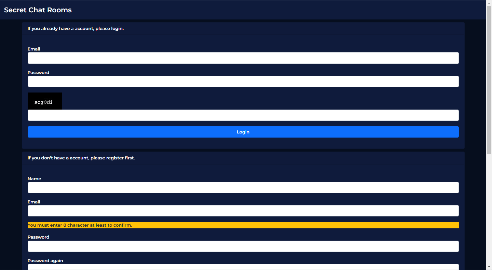
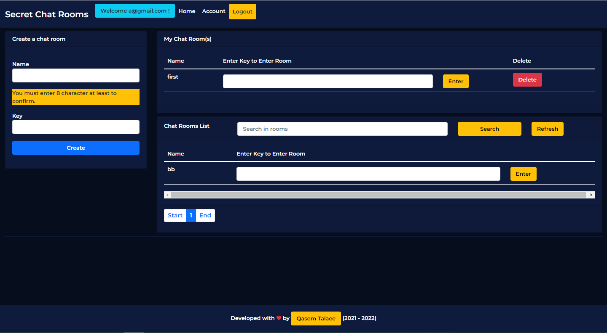
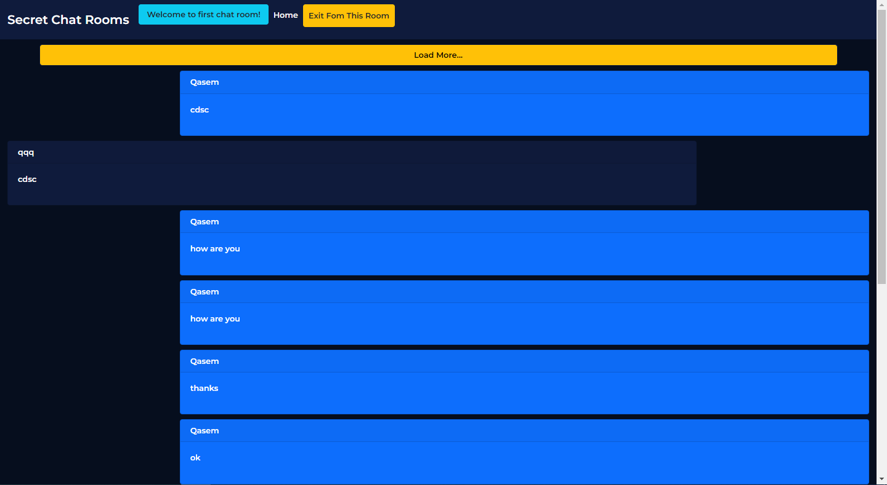

# Safe Chat Room
Chat with your audience in very safe and privacy place.Messages are stored encrypted and can only be decrypted with its own key.

The user can not enter the chat room without a key and decrypt the messages. This includes the system admin.

## How does it work?
When you create a chat room, you must enter a key that is hashed by the sha256 algorithm and stored in the database.

Then you can send the key to anyone else you want.With the key, users can enter to your chat room.

Messages are encrypted using the key, and anyone who does not have a key cannot encrypt messages.

This even includes the system admin. The system admin can not read messages from the database because it does not have the key to decrypt each.

## Installation
1. You must create a database and import `secret.sql` to it.
2. Edit your database information in `includes/db.php`.
3. Edit your gmail address and your gmail password in `includes/send_email.php` for send email to your users with smtp host.
4. (Optional) You can change the hash algorithm in `func/hash_pass.php` if you want.
5. Now you can login as admin with these information.

```
Email : admin@gmail.com
Password : admin
```

## See Some Screenshots
Login page :



Index page : 



Chat room page :

